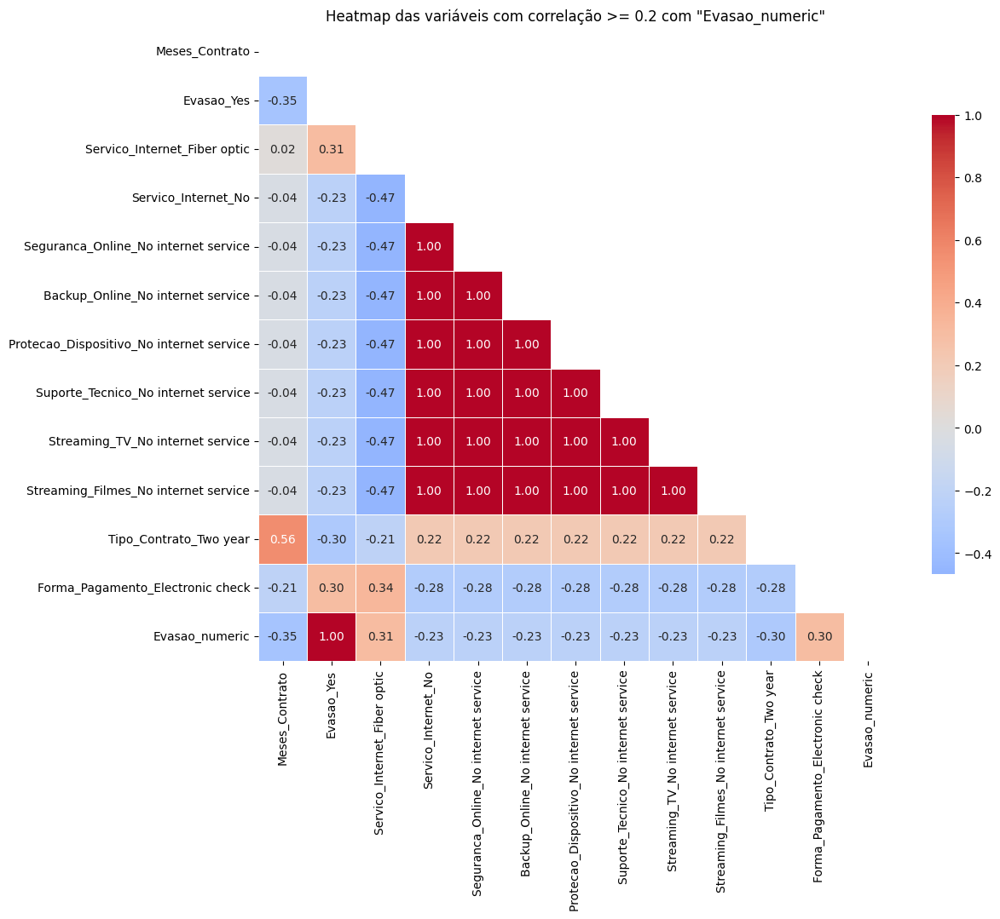
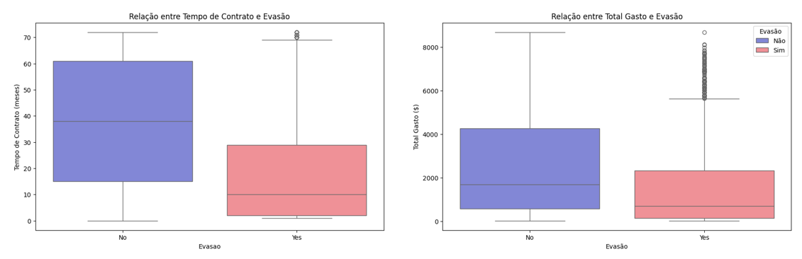
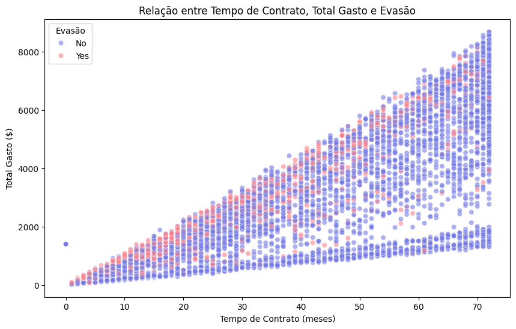
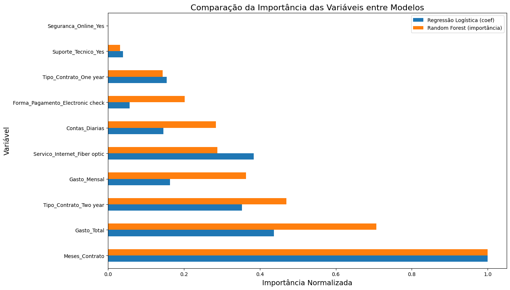

# Challenge TelecomX – Prevendo Evasão de Clientes (Churn)

## 📌 Proposta do Desafio
Este desafio faz parte do curso de Data Science, do programa Alura-ONE, T2025, para realização de uma análise sobre a evasão de clientes da empresa Telecom X.
Nesta nova etapa, a proposta foi de desenvolver modelos preditivos capazes de prever quais clientes têm maior chance de cancelar seus serviços.

## 🎯 Objetivo
- Preparar e tratar os dados para a modelagem.
- Selecionar variáveis relevantes por meio de análise de correlação.
- Treinar e avaliar modelos de classificação com métricas adequadas.
- Interpretar os resultados, destacando fatores que influenciam a evasão.
- Apontar conclusões estratégicas para retenção de clientes.

## 🛠️ Tecnologias Utilizadas
- Google Colab
- Python 3.10+
- Pandas
- NumPy
- Matplotlib
- Seaborn
- Plotl
- Scikit-learn

## 📲 Principais etapas do Projeto

### 🔧1. Preparação dos dados
- Remoção de colunas irrelevantes devido à multicolinearidade.
- Aplicação de `OneHotEncoder` com `ColumnTransformer` para variáveis categóricas.
- Balanceamento de Classes com SMOTE no conjunto de treino para lidar com o desbalanceamento entre classes (`Evasão` = 26,5%), igualando a proporção das classes.
- Aplicação de `StandardScaler` para normalização de dados de treino e teste, importante para modelos sensíveis à escala.
- Verificação da Proporção de Evasão para identificar a proporção de clientes que evadiram em relação aos que permaneceram ativos.

  

## 📈 2. Análise de Correlação
Foi criada uma matriz de correlação para identificar variáveis numéricas mais relacionadas à evasão. As variáveis com correlação absoluta ≥ 0,2 com a variável-alvo `Evasao_Yes` foram filtradas e analisadas em um novo heatmap.

- Correlação negativa moderada entre `Meses_contrato` e `Evaso` (-0.35) indica que quanto maior o tempo como cliente, menor a chance de evasão. Já a correlação entre `Tipo_Contrato_Two year` de -30 indica que contratos mais longos reduzem a evasão (clientes mais engajados ou com benefícios).
- Correlação positiva moderada entre `Servico_internet_Fiber optic` e `Evasao` de +31 indica que clientes com fibra ótica têm maior chance de Evasão, podendo estar relacionado ao custo ou à competitividade. A correlação de +30 entre `Forma_Pagamento_Electronic check` e `Evasao` indica que pagamentos por boleto eletrônico estão associados a mais evasão — talvez por perfil de cliente menos fidelizado.

## 📊 Análises Direcionadas
Para compreender melhor os fatores que impactam a evasão, foram utilizados boxplots e scatterplot a fim de identificar padrões de comportamento dos clientes. A análise parte da hipótese de que clientes com mais tempo de vínculo e maior valor investido têm maior probabilidade de se manter na empresa.

Os resultados mostraram que:
- **Tempo de Contrato × Evasão**: quanto menor tempo de contrato, maior a evasão.
- **Total Gasto × Evasão**: quanto mais gasto com serviços, menor é a frequência de evasão.
  

O **scatterplot** evidenciou que clientes com pouco tempo de contrato e baixo gasto total são mais propensos à evasão, enquanto aqueles de longo prazo e maior investimento apresentam maior fidelidade. Isso sugere a importância de estratégias de retenção nos primeiros meses, incentivos progressivos e monitoramento de clientes de baixo gasto e curta permanência.

## 🤖 Modelagem Preditiva

### 💡 Criação de Modelos
Na etapa de modelagem preditiva, a preparação adequada dos dados é fundamental. Inicialmente, o conjunto foi dividido em 70% para treino e 30% para teste, utilizando a função train_test_split. Para garantir representatividade, aplicou-se a estratificação pela variável churn, de modo a manter a proporção entre as classes em ambos os conjuntos, evitando distorções comuns em cenários desbalanceados.

Com os dados de treino balanceados e padronizados, foram construídos dois modelos de classificação e, em seguida, avaliados com os dados de teste. Os algoritmos escolhidos foram:

- **Regressão Logística**, que requer normalização para melhor desempenho;
- **Random Forest**, que não possui essa exigência por se basear em árvores de decisão.

A avaliação dos modelos foi realizada por meio das seguintes métricas:
- Acurácia
- Precisão
- Recall
- F1-score
- Matriz de confusão

### 📊 Desempenho dos Modelos no Conjunto de Teste

**Regressão Logística e Random Forest**
|Critério | Regressão Logística| Random Forest|
| --------|------------------- |------------- |
|Acurácia           |0.80      |0.66          |
|Recall (evasão)    |0.54      |0.88          |
|Precisão (evasão)  |0.64      |0.43          |
|F1-score (evasao)  |0.59      |0.58          |
|AUC                |0.84      |0.81          |

- **Precisão (Evasão)**: A Regressão Logística (0.64) é bem melhor que o Random Forest (0.43). Ou seja, quando o modelo diz que um cliente vai sair, a chance de ele realmente sair é maior na Regressão Logística.
- **Recall (Evasão)**: O Random Forest (0.88) supera muito a Logística (0.54). Ele consegue capturar mais clientes que realmente saem, mas erra bastante nos falsos positivos.
- **F1-score (Evasão)**: Ambos estão parecidos (0.59 vs 0.58), cada um equilibrando de formas diferentes.
- **Acurácia**: A Regressão Logística (0.80) é mais alta que o Random Forest (0.66), mas  isso é influenciado pela maioria de clientes que não saem.
- **AUC**: A Regressão Logística (0.84) tem uma curva ROC um pouco melhor que o Random Forest (0.81), ou seja, separa melhor os grupos em termos gerais.

## 💡 Interpretação e Conclusões

### 📌 Análise de Importância das Variáveis
Os principais fatores associados à evasão de clientes evidenciados na análise dos coeficientes da Regressão Logística e da importância das variáveis no Random Forest foram, em ordem decrescente:
- **Regressão Logística**: tempo de contrato, gasto total, serviço de internet por fibra ótica e tipo de contrato (2 anos).
- **Random Forest**: tempo de contrato, gasto total, tipo de contrato (2 anos), gasto mensal, serviço de internet por fibra ótica e contas diárias.

### 🏆 Conclusões sobre a escolha do melhor modelo
- A Regressão Logística mostrou melhor desempenho em identificar clientes que não cancelam, mas falhou em capturar muitas evasões. 
- Já o Random Forest apresentou alto recall para evasão (0,88), detectando mais clientes que cancelam, porém com maior número de falsos positivos. 

Assim, a escolha depende da estratégia:
- **Regressão Logística**: melhor se a empresa precisa ser assertiva e otimizar recursos de retenção.
- **Random Forest**: melhor se a prioridade é reduzir ao máximo a perda de clientes, mesmo com custo maior.

## 🎯 Recomendações: Propostas de Estratégias de Retenção 
- **Segmentar clientes em risco** com Random Forest e aplicar campanhas preventivas (suporte ativo, ofertas personalizadas).
- **Atuar nos fatores críticos**: incentivar contratos de longo prazo, oferecer serviços adicionais e ajustar formas de pagamento.
- **Criar programas de fidelidade** com recompensas e benefícios para clientes antigos.
- **Adotar atendimento proativo**, com contato personalizado e pesquisas de satisfação para reduzir cancelamentos.
- **Monitorar continuamente combinando modelos**: Regressão Logística para entender perfis e Random Forest para detectar clientes em risco.

